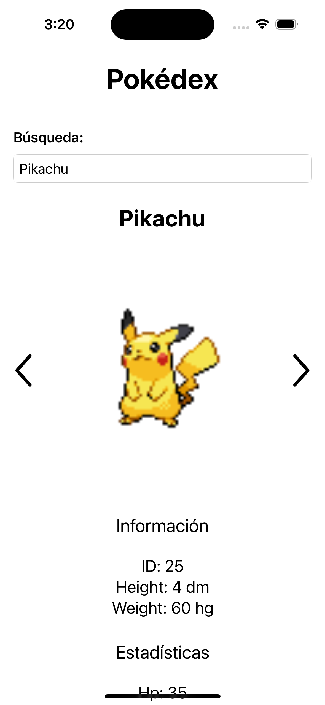

# Practicante iOS Test

Este proyecto es una aplicación de Pokédex desarrollada en Swift que permite a los usuarios buscar y visualizar información detallada de los Pokémon utilizando la PokéAPI. 

## Características

- **Búsqueda por nombre o ID**: Los usuarios pueden ingresar el nombre o el ID de un Pokémon para obtener sus datos.
- **Caché de resultados**: Usa un método de caché para almacenar los Pokémon buscados y evitar llamadas redundantes a la API.
- **Navegación entre Pokémon**: Botones de flecha permiten navegar fácilmente al Pokémon anterior o siguiente.
- **Información detallada**: Muestra el nombre, imagen, altura, peso, y estadísticas base (HP, ataque, defensa, etc.) de cada Pokémon.

## Capturas de Pantalla




## Video de Demostración
[](https://youtu.be/auOZZPLv2Ro)

## Instalación

1. Clona este repositorio:
    ```sh
    git clone https://github.com/EdgarAlexandro/Test-Practicante-iOS.git
    ```
2. Abre el proyecto en Xcode:
    ```sh
    cd Test-Practicante-iOS
    open Test\ Practicante\ iOS.xcodeproj
    ```
3. Ejecuta la aplicación en el simulador o en tu dispositivo iOS.

## Uso

- Abre la aplicación.
- Ingresa el nombre o ID de un Pokémon en el campo de búsqueda y presiona Enter.
- Usa los botones de flecha para navegar entre Pokémon (previous/next).
- Desplázate hacia abajo para ver toda la información detallada y estadísticas del Pokémon.
